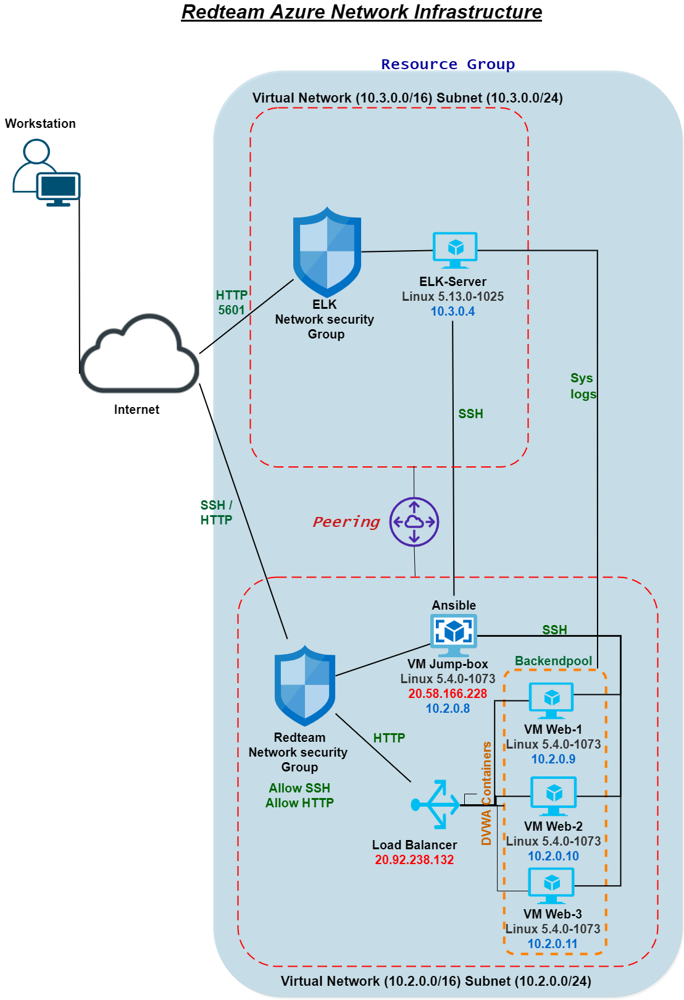

## Automated ELK Stack Deployment

The files in this repository were used to configure the network depicted below.



These files have been tested and used to generate a live ELK deployment on Azure. They can be used to either recreate the entire deployment pictured above. Alternatively, select portions of the configuration file may be used to install only certain pieces of it, such as Filebeat.

  - _TODO: Enter the playbook file.

This document contains the following details:
- Description of the Topology
- Access Policies
- ELK Configuration
  - Beats in Use
  - Machines Being Monitored
- How to Use the Ansible Build


### Description of the Topology

The main purpose of this network is to expose a **load-balanced** and **monitored** instance of DVWA, the D*mn Vulnerable Web Application.

> *Load balancing* ensures that the application will be highly functional, in addition to restricting access to the network.
What aspect of security do load balancers protect? What is the advantage of a jump box?
load balancers increase uptime and reduce chances of failure by distributing and managing network traffic in order to prevent overloading.
The jump-box provides a layer of security by only allowing authorized users such as system admin to gain access to the network.

Integrating an ELK server allows users to easily monitor the vulnerable VMs for changes to the network and system logs.
- _What does Filebeat watch for?_
  -  Filebeat mintors and forwards log data to a specified location to either [Elasticsearch](https://www.elastic.co/elasticsearch/) or [Logstash](https://www.elastic.co/logstash/) for indexing.

- _What does Metricbeat record?_
   - Metricbeat records metrics/static data from operating system and serives running on a server which can be directly inserted into [Elasticsearch](https://www.elastic.co/elasticsearch/) or send to [Logstash](https://www.elastic.co/logstash/).

The configuration details of each machine may be found below.
_Note: Use the [Markdown Table Generator](http://www.tablesgenerator.com/markdown_tables) to add/remove values from the table_.

| Name       | Function | IP Address | Operating System |
|------------|----------|------------|------------------|
| Jump Box   | Gateway  | 10.2.0.8   | Linux            |
| Web-1      | Server   | 10.2.0.9   | Linux            |
| Web-2      | Server   | 10.2.0.10  | Linux            |
| Web-3      | Server   | 10.2.0.11  | Linux            |
| ELK Server | Server   | 10.3.0.4   | Linux            |

### Access Policies

The machines on the internal network are not exposed to the public Internet. 

Only the Jump-Box-Provisioner machine can accept connections from the Internet. Access to this machine is only allowed from the following IP addresses:
- Jump-Box-Provisioner Public IP: 20.58.166.228

Machines within the network can only be accessed by Jump-Box Provisioner.

- _Which machine did you allow to access your ELK VM?_
  - Jump-Box-Provisoner 
- _What was its IP address?_
  -  10.2.0.8 (Private IP)

A summary of the access policies in place can be found in the table below.

| Name       | Publicly Accessible | Allowed IP Addresses         |
|------------|---------------------|------------------------------|
| Jump Box   | Yes                 | 10.2.0.8 <br/>20.58.166.228  |
| ELK Server | Yes                 | 10.3.0.4 <br/>52.243.100.162 |
| Web-1      | No                  | 10.2.0.9                     |
| Web-2      | No                  | 10.2.0.10                    |
| Web-3      | No                  | 10.2.0.11                    |

### Elk Configuration

Ansible was used to automate configuration of the ELK machine. No configuration was performed manually, which is advantageous because it means everytime we create a new machine we do not need to manually configure it. Ansible will ensure machines are configured as specified and ready whenever started. This also reduces risk of human errors and makes the machine configurating process 

The playbook implements the following tasks:

- uses `apt` to install `docker.io` : The Docker engine used for running containers
- uses `apt` to install `python3-pip` : Package used to install Python software
- uses `pip` yo install `docker` : Python client for Docker. This is required by ansible to control the state of Docker containers
- configures target machine to use more memory
- use `sysctl` to ensure all configurations tasks are complete when machine starts
- Download the container called `sebp/elk:761` : `elk` container is made by `sebp` and the version is `761`
- uses `docker container` to configure the following port mappings: <br/> -  `5601:5601` <br/> - `9200:9200` <br/> - `5044:5044`
- uses `systemd` to enable docker service on boot


The following screenshot displays the result of running `docker ps` after successfully configuring the ELK instance.


### Target Machines & Beats
This ELK server is configured to monitor the following machines:
- Web-1 (10.2.0.9)
- Web-2 (10.2.0.10)
- Web-3 (10.2.0.11)

We have installed the following Beats on these machines:
- Filebeat
- Metricbeat

These Beats allow us to collect the following information from each machine:
  - **_Filebeat_** collects and ships log files containing information about the file system. This may include audit logs, server logs etc.
  - **_Metricbeat_** collects and reports metrics from the operating system and other services. It can be used as a monitoring tool and can provide information on modules such as system module which will include metricsets containing cpu, process summary and uptime.


### Using the Playbook
In order to use the playbook, you will need to have an Ansible control node already configured. Assuming you have such a control node provisioned: 


SSH into the control node and follow the steps below:
- Copy the [filebeat-configuration.yml](https://github.com/TashBinary/Automated-ELK-Stack-Development/blob/main/Ansible/filebeat-configuration.yml) file to `/etc/ansible/files`.

   - run `curl https://github.com/TashBinary/Automated-ELK-Stack-Development/blob/main/Ansible/filebeat-configuration.yml > /etc/ansible/files/filebeat-configuration.yml`

- Update the [filebeat-configuration.yml](https://github.com/TashBinary/Automated-ELK-Stack-Development/blob/main/Ansible/filebeat-configuration.yml) file to include the following:

line #1106 update the private IP of your ELK server 
```
output.elasticsearch:
hosts: ["10.3.0.4:9200"]
username: "elastic"
password: "changeme"
```
as well as on line #1806
```
setup.kibana:
host: "10.3.0.4:5601"
```

- Copy the [filebeat-playbook.yml](https://github.com/TashBinary/Automated-ELK-Stack-Development/blob/main/Ansible/filebeat-playbook.yml) file to `/etc/ansible/roles`

   - run `curl https://github.com/TashBinary/Automated-ELK-Stack-Development/blob/main/Ansible/filebeat-playbook.yml > /etc/ansible/roles/filebeat-playbook.yml`

- run `filebeat modules enable system`
- run `filebeat setup`
- run `service filebeat start`


- Run the playbook using command `ansible-playbook filebeat-playbook.yml`, and navigate to `system logs` on your kibana homepage to check that the installation worked as expected. Scroll to `Step 5: Module Status` clicking on `Check Data` at the end of the page. 


The above steps can also be used to install Metricbeat.

-------

- _Which file is the playbook? Where do you copy it?_
   - the playbook is [filebeat-playbook.yml](https://github.com/TashBinary/Automated-ELK-Stack-Development/blob/main/Ansible/filebeat-playbook.yml). Copy it to `/etc/ansible/roles`
- _Which file do you update to make Ansible run the playbook on a specific machine? How do I specify which machine to install the ELK server on versus which to install Filebeat on?_
   - update `/etc/ansible/hosts` file by adding your VM IP addresses under hosts. Filebeat is installed onto the VMs with IP under webservers and ELK server is installed onto the machine under the elk. 
```
  # /etc/ansible/hosts

    [webservers]
	10.2.0.9 ansible_python_interpreter=/usr/bin/python3
	10.2.0.10 ansible_python_interpreter=/usr/bin/python3
	10.2.0.11 ansible_python_interpreter=/usr/bin/python3

	[elk]
	10.3.0.4 ansible_python_interpreter=/usr/bin/python3
```
- _Which URL do you navigate to in order to check that the ELK server is running?
   - http://52.243.100.162:5601/app/kibana#/home?_g=() 

_As a **Bonus**, provide the specific commands the user will need to run to download the playbook, update the files, etc._

